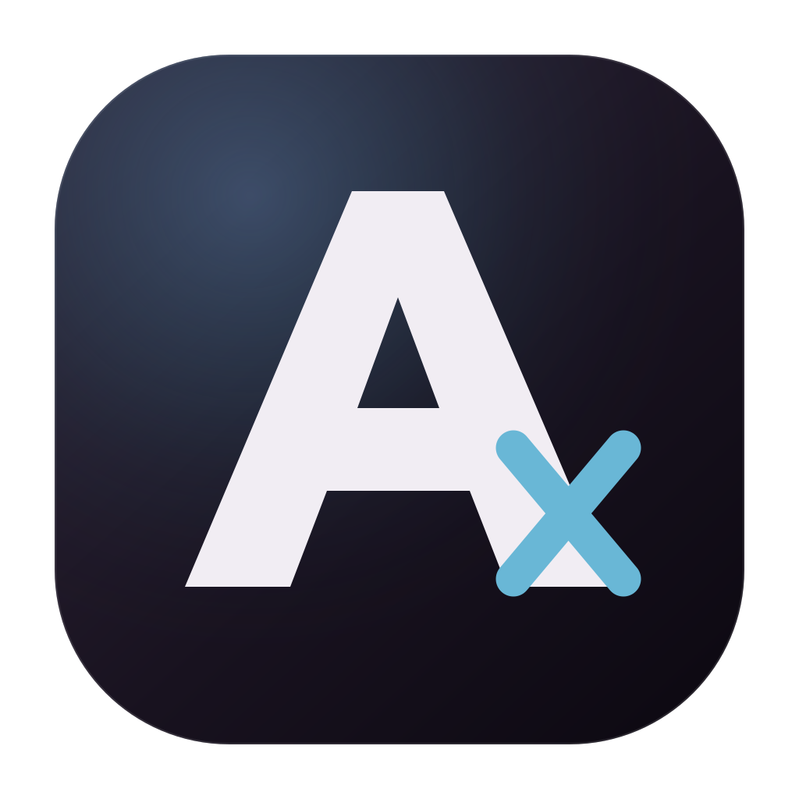

<p align="center">
  
</p>

<h1 align="center">AporiaX</h1>

<p align="center">
  <a href="README.md">简体中文</a> · <strong>English</strong>
</p>

<p align="center">
  <strong>Begin with an aporia.</strong><br>
  Write code, create documents, presentations, and spreadsheets. Tell AporiaX where you want to arrive.
</p>

<p align="center">
  <em>Every problem begins with an aporia.</em>
</p>

<p align="center">
  <a href="https://github.com/CaptainLand/AporiaX/releases/tag/v0.3.0"></a>
  <a href="https://github.com/CaptainLand/AporiaX/releases/download/v0.3.0/AporiaX-Setup-0.3.0-x64.exe"></a>
  <a href="LICENSE"></a>
</p>

AporiaX is a local-first desktop agent that turns ambiguous requests into
observable, verifiable, and reversible routes. It works directly inside an
authorized workspace, edits code, creates real Office files, and keeps actions,
evidence, changes, and deliverables visible instead of reducing the work to a
chat response.

> [!IMPORTANT]
> AporiaX `v0.3.0` is still a preview and currently ships for Windows x64.
> `run_command` runs automatically in a temporary local workspace copy and
> conflict-checks project changes before synchronizing them back. Docker is
> entirely optional; enabling it upgrades execution to an offline,
> read-only-root OS-level container. The local sandbox isolates workspace
> changes but still uses the current user's host network and process permissions.

## Why AporiaX

- **Route** shows the steps that actually occurred during every task.
- **Evidence** preserves tool calls, file changes, verification, and failures.
- **Anchor** creates file checkpoints for line-by-line review and safe rollback.

## What it can do today

| Capability | Current implementation |
| --- | --- |
| Code and workspace | File tree, search, preview, editing, `Ctrl+S`, precise patches, Git status and diff |
| Document production | Real `.docx`, `.pptx`, and `.xlsx` generation with structural inspection |
| Observable execution | Dialogue, Route, and Workspace views with step-by-step actions and changes |
| Review and rollback | File snapshots, line diffs, Office binary checkpoints, per-file or per-turn revert |
| Mandatory self-check | Re-reads changed files, attempts tests or builds, fixes findings, and records remaining risks |
| Multiple model APIs | Multiple OpenAI-compatible providers and keys, `/models` discovery, task-level model selection |
| Bilingual interface | Switch Chinese and English from the welcome screen or settings; new replies follow the interface language |
| Attachments | PDF, Office, Markdown, code, and image attachments with local PDF text extraction |
| Permissions and execution | `allow` / `ask` / `deny` policy, automatic local workspace sandbox, optional stronger Docker isolation |

Scanned PDFs are detected as requiring OCR, but an OCR engine is not bundled
yet. Image delivery depends on the vision capability of the selected model.

## Download

| Windows x64 | Use case |
| --- | --- |
| [Installer](https://github.com/CaptainLand/AporiaX/releases/download/v0.3.0/AporiaX-Setup-0.3.0-x64.exe) | Standard installation, desktop shortcut, and Start menu |
| [Portable](https://github.com/CaptainLand/AporiaX/releases/download/v0.3.0/AporiaX-Portable-0.3.0-x64.exe) | Run and evaluate without installation |

After the first launch:

1. Create a task and choose a local workspace.
2. Add an OpenAI-compatible API provider and model.
3. Describe the outcome, then inspect Route, file changes, self-check, and deliverables.

Docker Desktop is optional. Without it, commands run automatically in a
temporary workspace copy and project changes are conflict-checked before they
are synchronized back. With Docker enabled, commands use a network-disabled
container with stronger OS-level isolation.

## Run from source

Node.js 20 or newer is required. Start Docker Desktop only if you want stronger
containerized `run_command`; the in-app **Enable stronger Docker isolation**
action builds the local `aporiax-sandbox:0.1` image. Commands work without
Docker and do not require per-command approval in automatic mode.

```powershell
git clone https://github.com/CaptainLand/AporiaX.git
cd AporiaX
npm install
npm run dev
```

On first use, add an API base URL and API key in **Model providers**. AporiaX
supports OpenAI-compatible Chat Completions APIs, attempts model discovery
through `/models`, and also accepts manually entered model IDs. Multiple
providers can coexist, and each task can use a different model.

For backward compatibility, DeepSeek can also be configured through an
environment variable:

```powershell
$env:DEEPSEEK_API_KEY="your-api-key"
npm start
```

API keys are encrypted with Electron `safeStorage` and are never returned to
the renderer. Never put real credentials in source code, `.env`, issues, or
logs.

## Common commands

```powershell
# Development: Vite and Electron
npm run dev

# Runtime and P0 data model tests
npm run test:runtime
npm run test:p0

# Production web build
npm run build

# Windows installer and portable package
npm run dist:win
```

## Creating Office files

Create a task with workspace write access, bind a workspace, and describe the
deliverable:

```text
Create project-weekly-report.docx with a title, progress highlights, risks,
and a milestone table.
```

```text
Create a six-slide quarterly review.pptx and a sales-dashboard.xlsx with
growth formulas.
```

Harness uses structured Office tools, then re-parses document blocks, slides,
worksheets, and formulas. Structural inspection does not replace a final visual
review in Word, PowerPoint, or Excel.

## Project-level permissions

Add `.aporiax.json` to the workspace root:

```json
{
  "permissions": {
    "write_file": "ask",
    "apply_patch": "ask",
    "create_word_document": "ask",
    "create_presentation": "ask",
    "create_spreadsheet": "ask",
    "run_command": "deny"
  }
}
```

Project configuration can only restrict task permissions. It cannot elevate a
read-only task or disable Harness control tools used by mandatory self-check.

## Repository layout

```text
electron/   Electron main process, Harness, tools, and security boundaries
src/        React UI, Route, Workspace, and review experience
tests/      Runtime and P0 behavior tests
docs/       Architecture and Harness roadmap
build/      Application icons and build resources
```

See [docs/HARNESS_ROADMAP.md](docs/HARNESS_ROADMAP.md) for current Harness
architecture and plans. See
[docs/RELEASE_NOTES_v0.3.0.md](docs/RELEASE_NOTES_v0.3.0.md) for this release.

## Contributing

Read [CONTRIBUTING.md](CONTRIBUTING.md). Report security issues privately as
described in [SECURITY.md](SECURITY.md); never disclose real credentials or
vulnerability details publicly.

## License

[MIT](LICENSE) © 2026 CaptainLand
