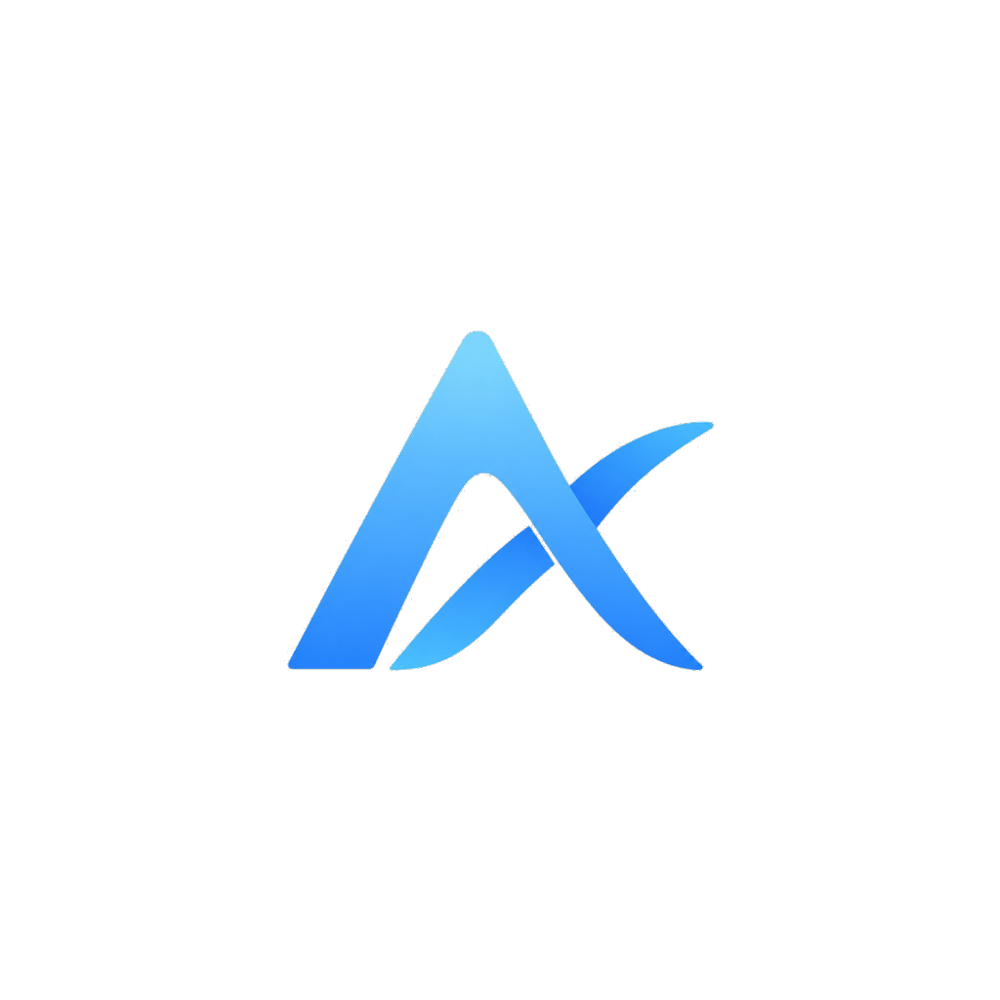
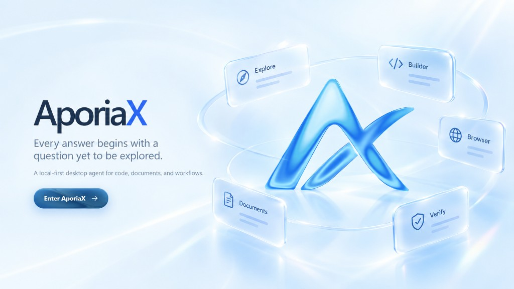
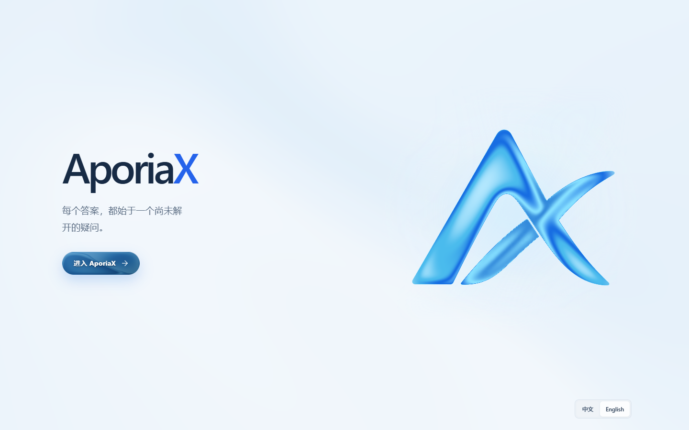
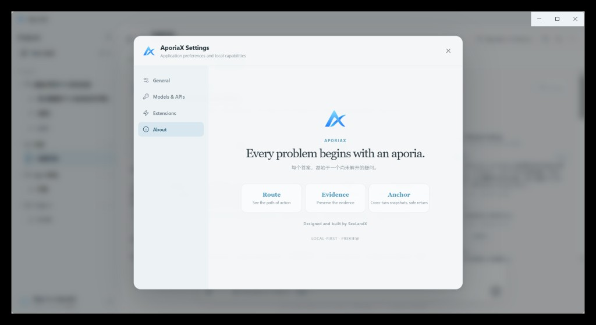
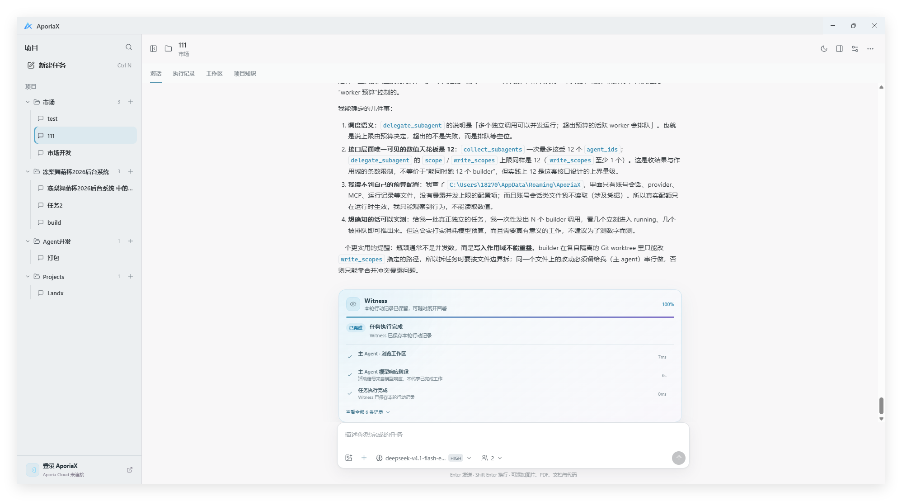
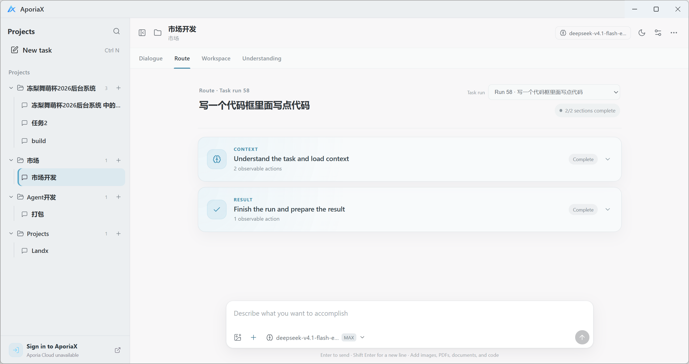
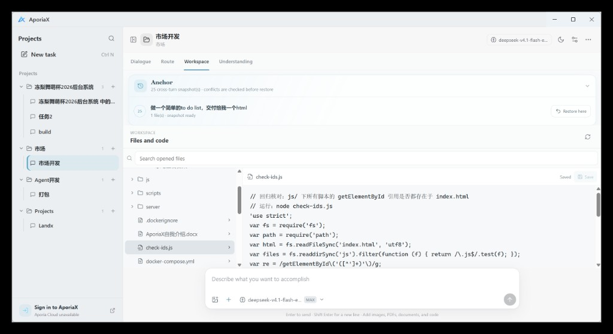
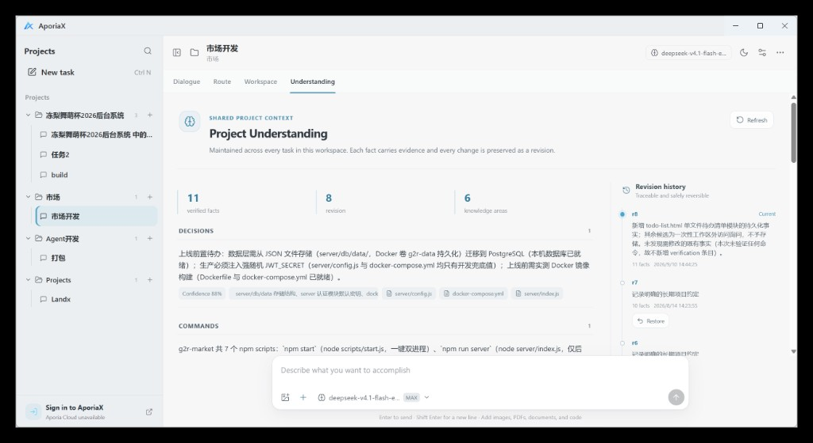

<p align="center">
  
</p>

<h1 align="center">AporiaX</h1>

<p align="center">
  <a href="README.md">简体中文</a> · <strong>English</strong>
</p>

<p align="center">
  <strong>Begin with an aporia.</strong><br>
  Write code, create documents, presentations, and spreadsheets. Tell AporiaX where you want to arrive.
</p>

<p align="center">
  <em>Every problem begins with an aporia.</em>
</p>

<p align="center">
  <a href="https://github.com/CaptainLand/AporiaX/tree/v0.6.5"></a>
  <a href="https://github.com/CaptainLand/AporiaX/releases"></a>
  <a href="LICENSE"></a>
</p>

<p align="center">
  
</p>

AporiaX is a local-first desktop agent that turns ambiguous requests into observable, verifiable, and reversible routes. It works inside an authorized workspace, edits code, creates real Office files, and keeps actions, evidence, changes, and deliverables visible instead of reducing the work to a chat response.

> [!IMPORTANT]
> The current AporiaX source version is **`v0.6.5`**. The project is still in Preview, with Windows x64 as the current packaged target.
> The `v0.6.5` source tag is already published; until the matching 0.6.5 GitHub Release is published, the newest public Windows binaries in Releases may still be `v0.6.1`.
> In 0.6.5, Permission and Execution Mode are separate boundaries: Smart Permission decides whether an operation may run, while Direct / Safe / Isolated decide where it runs.

## Why AporiaX

- **Route** shows the steps that actually occurred during every task.
- **Evidence** preserves tool calls, file changes, verification, and failures.
- **Anchor** brings restorable checkpoints beside each turn, with diff preview, conflict detection, and safe rollback.

## See the work happen

<table>
  <tr>
    <td width="50%"></td>
    <td width="50%"></td>
  </tr>
  <tr>
    <td align="center"><strong>Begin with an aporia</strong><br><sub>A restrained particle-ocean welcome screen with bilingual entry</sub></td>
    <td align="center"><strong>Route · Evidence · Anchor</strong><br><sub>See the route, preserve the evidence, and roll back safely</sub></td>
  </tr>
  <tr>
    <td width="50%"></td>
    <td width="50%"></td>
  </tr>
  <tr>
    <td align="center"><strong>Dialogue</strong><br><sub>Tasks, self-checks, deliverables, and follow-ups in one workflow</sub></td>
    <td align="center"><strong>Route</strong><br><sub>Inspect tools, files, commands, timing, and concrete changes step by step</sub></td>
  </tr>
  <tr>
    <td width="50%"></td>
    <td width="50%"></td>
  </tr>
  <tr>
    <td align="center"><strong>Workspace</strong><br><sub>Expand the project tree, preview code, and manage cross-turn Anchors</sub></td>
    <td align="center"><strong>Understanding</strong><br><sub>Version architecture, conventions, commands, preferences, and debugging knowledge</sub></td>
  </tr>
</table>

## What's new in 0.6.5: execution, LSP, and complete GitHub Agent workflows

### Direct / Safe / Isolated

AporiaX now separates **whether** an operation can run from **where** it runs:

- **Direct** — executes directly in the authorized workspace with host process and network authority.
- **Safe** — executes in a temporary workspace copy and synchronizes changes back only after conflict checks. It protects workspace mutations but still uses host process/network authority.
- **Isolated** — executes in the Docker sandbox with stronger OS-level isolation. A selected Isolated run never silently falls back to Host.

Smart Permission applies deterministic risk classification before execution. Low-risk inspection and common build/test/lint/type-check workflows can be automatic; dependency mutation, explicit network access, remote writes, and destructive operations require approval; clearly system-destructive commands are denied.

### Persistent LSP

AporiaX now includes a persistent native LSP runtime with:

- diagnostics
- definition
- references
- hover
- document symbols
- workspace symbols

TypeScript / JavaScript language intelligence is bundled. If supported external language servers are missing, the Agent can inspect availability and request approval to install Pyright, gopls, rust-analyzer, or clangd through `lsp_install`.

### Git / GitHub Agent workflow

AporiaX can now move from a normal folder to a reviewable GitHub pull request without asking the user to bootstrap Git manually:

1. `git_init`
2. `git_status` / `git_diff` / `git_log`
3. explicit `git_stage`
4. `git_commit`
5. `git_create_branch`
6. `git_remote_list` / `git_remote_add`
7. `git_pull` / `git_push`
8. `github_repo_create`
9. `github_pr_create`
10. `github_pr_view` / `github_pr_checks`

Local Git lifecycle operations may run autonomously under workspace-write policy. Remote add, pull/push, GitHub repository creation, and PR creation remain approval-gated. Force push is intentionally not exposed as a native workflow.

[Read the complete 0.6.5 notes](docs/releases/v0.6.5.md) · [Browse the v0.6.5 source tag](https://github.com/CaptainLand/AporiaX/tree/v0.6.5)

## What it can do today

| Capability | Current implementation |
| --- | --- |
| Code and workspace | Paged/ranged reads, bundled ripgrep, file tree, preview/editing, multi-file Unified Patch, Git status and diff |
| Language intelligence | Persistent LSP diagnostics, definition, references, hover, document symbols, workspace symbols, plus approval-gated language-server installation |
| Git / GitHub | `git_init`, stage/commit/branch, remotes, pull/push, repository creation, PR creation, PR inspection, and CI checks |
| Permissions and execution | Smart Permission plus Direct / Safe / Isolated execution; remote and higher-risk side effects remain explicit approval boundaries |
| Document production | Real `.docx`, `.pptx`, and `.xlsx` generation with structural inspection |
| Adaptive multi-agent execution | Adaptive Agent Budget keeps simple tasks Main-only and grants bounded extra agents only when task complexity needs them |
| Builder orchestration | Eligible large writable tasks can use up to two Builders with Task Graph scheduling, Scope Leases, isolated Git worktrees, and conflict-safe merge |
| Agent collaboration | Shared Contracts, deterministic Plan Approval, structured handoffs, and a bounded mailbox; Main remains final integration authority |
| Observable execution | Witness reports main/subagent activity, duration, failures, and self-check stages while Route preserves the full trace |
| Review and rollback | File snapshots, line diffs, Office binary checkpoints, per-turn Anchors, cross-turn recovery, and atomic conflict checks |
| Mandatory self-check | Review/Verify subagents inspect current file versions before a lightweight final seal over tests, risks, and deliverables |
| Project understanding | Understanding stores reusable architecture, conventions, commands, preferences, and debugging knowledge for the workspace |
| Extensions | Skills, MCP, Browser, Office, and native tools share the same capability system |
| Multiple model APIs | Multiple OpenAI-compatible providers and keys, `/models` discovery, and task-level model selection |
| Desktop background lifecycle | Tasks may continue in the Windows system tray with restore/exit, completion notifications, and live runtime display |

Scanned PDFs are detected as requiring OCR, but an OCR engine is not bundled yet. Image delivery depends on the vision capability of the selected model.

## Download

The `v0.6.5` source is already fixed by tag. The Windows 0.6.5 binaries will be linked here once the matching GitHub Release is published.

| Windows x64 | Current public package |
| --- | --- |
| [Browse Releases](https://github.com/CaptainLand/AporiaX/releases) | Installer and portable downloads; this becomes the 0.6.5 binary entry point after release publication |
| [0.6.1 Installer](https://github.com/CaptainLand/AporiaX/releases/download/v0.6.1/AporiaX-Setup-0.6.1-x64.exe) | Current published installer |
| [0.6.1 Portable](https://github.com/CaptainLand/AporiaX/releases/download/v0.6.1/AporiaX-Portable-0.6.1-x64.exe) | Current published portable build |

After the first launch:

1. Create a task and choose a local workspace.
2. Add an OpenAI-compatible API provider and model.
3. Describe the outcome, then inspect Route, file changes, self-check, and deliverables.

## Run from source

**Node.js 22.12.0 or newer is required.**

Docker Desktop is required only for Isolated execution. Direct and Safe work without Docker: Safe uses a temporary workspace copy with conflict-checked synchronization, while Direct operates on the authorized workspace directly.

```powershell
git clone https://github.com/CaptainLand/AporiaX.git
cd AporiaX
npm install
npm run dev
```

On first use, add an API base URL and API key in **Model providers**. AporiaX supports OpenAI-compatible Chat Completions APIs, attempts model discovery through `/models`, and also accepts manually entered model IDs. Multiple providers can coexist, and each task can use a different model.

For backward compatibility, DeepSeek can also be configured through an environment variable:

```powershell
$env:DEEPSEEK_API_KEY="your-api-key"
npm start
```

API keys are encrypted with Electron `safeStorage` and are never returned to the renderer. Never put real credentials in source code, `.env`, issues, or logs.

## Common commands

```powershell
# Development
npm run dev

# 0.6.5 core validation
npm run test:runtime
npm run test:architecture
npm run test:execution-policy
npm run test:execution-wiring
npm run test:lsp
npm run test:lsp-installer
npm run test:github-workflow
npm run test:tool-permissions
npm run test:tool-dispatcher

# Production build
npm run build

# Windows installer and portable package
npm run dist:win
```

## Subagents and project context

AporiaX runs independent read tools concurrently and delegates larger exploration, review, and verification work to isolated Explore, Review, and Verify subagents. Curator handles durable project understanding. For eligible large writable Git tasks, Harness can plan up to two Builders that work inside isolated Git worktrees under Scope Leases before Main integrates their changes after conflict checks.

Parallel Builders must pass a Shared Contract and Plan Approval first, sharing cross-module invariants, acceptance criteria, and Main-owned shared-file boundaries. Main keeps final integration authority, while Witness remains observation-only.

Harness recognizes `AGENTS.md`, `APORIAX.md`, and `DEEPAGENT.md` in the workspace as well as path-scoped `.aporiax/rules/*.md`. Project Understanding stores verified commands, architecture conventions, and explicit preferences; credentials are rejected.

## Project-level permissions

Add `.aporiax.json` to the workspace root:

```json
{
  "permissions": {
    "write_file": "ask",
    "apply_patch": "ask",
    "create_word_document": "ask",
    "create_presentation": "ask",
    "create_spreadsheet": "ask",
    "delegate_subagent": "allow",
    "remember_project_fact": "allow",
    "run_command": "deny"
  }
}
```

Project configuration can only restrict task permissions. It cannot elevate a read-only task or disable Harness control tools used by mandatory self-check.

## Repository layout

```text
electron/   Electron main process, Harness, tools, and security boundaries
src/        React UI, Route/Workspace, and review experience
tests/      Runtime and behavior validation
docs/       Architecture, release notes, and Harness roadmap
build/      Application icons and build resources
```

See [docs/HARNESS_ROADMAP.md](docs/HARNESS_ROADMAP.md) for current Harness architecture and plans. See [CHANGELOG.md](CHANGELOG.md) for version history.

## Contributing

Read [CONTRIBUTING.md](CONTRIBUTING.md). Report security issues privately as described in [SECURITY.md](SECURITY.md); never disclose real credentials or vulnerability details publicly.

## License

[MIT](LICENSE) © 2026 CaptainLand
