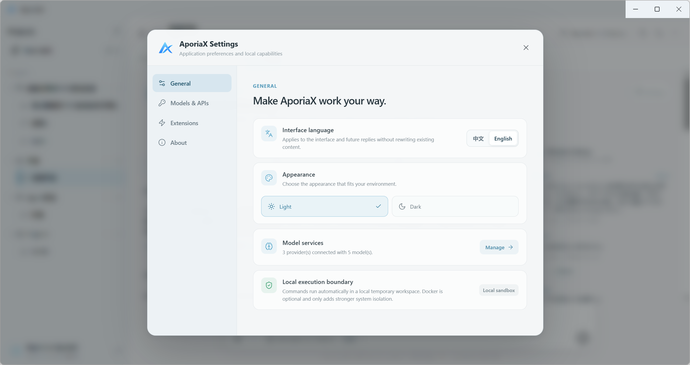
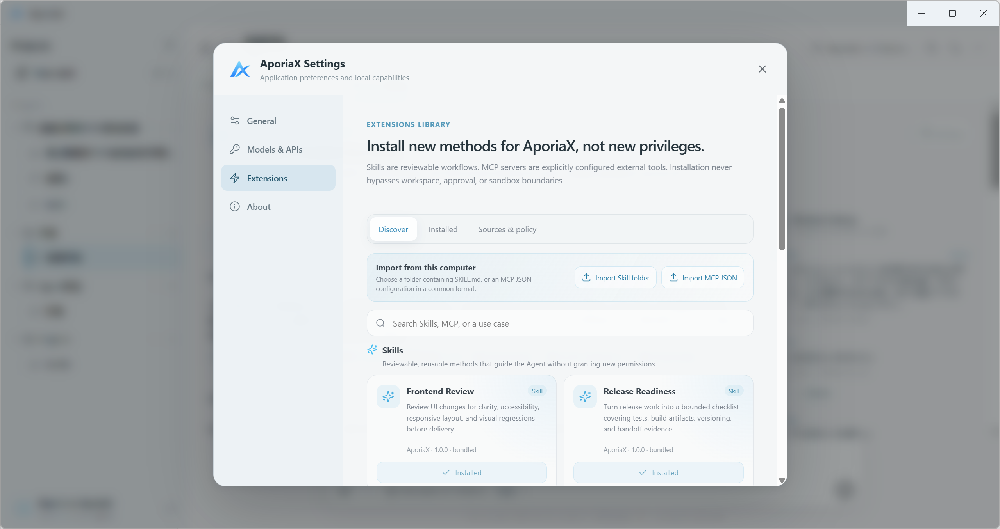

<p align="center">
  
</p>

<h1 align="center">AporiaX</h1>

<p align="center">
  <a href="README.md">简体中文</a> · <strong>English</strong>
</p>

<p align="center">
  <strong>Begin with an aporia.</strong><br>
  Write code, create documents, presentations, and spreadsheets. Tell AporiaX where you want to arrive.
</p>

<p align="center">
  <em>Every problem begins with an aporia.</em>
</p>

<p align="center">
  <a href="https://github.com/CaptainLand/AporiaX/tree/main"></a>
  <a href="https://github.com/CaptainLand/AporiaX/releases"></a>
  <a href="LICENSE"></a>
</p>

<p align="center">
  
</p>

AporiaX is a local-first desktop agent that turns ambiguous requests into observable, verifiable, and reversible routes. It works inside an authorized workspace, edits code, creates real Office files, and keeps actions, evidence, changes, and deliverables visible instead of reducing the work to a chat response.

> [!IMPORTANT]
> The current AporiaX source and Windows release version is **`v0.8.5`**. The project remains in Preview.
> 0.8.5 tells later model runs that Anchor restore rewound workspace files, so they must not continue the restored implementation.
> Aporia Account, Aporia Cloud, BYOK, and local-model paths remain independent.

## Why AporiaX

- **Route** shows the steps that actually occurred during every task.
- **Evidence** preserves tool calls, file changes, verification, and failures.
- **Anchor** brings restorable checkpoints beside each turn, with diff preview, conflict detection, and safe rollback.

## See the work happen

<table>
  <tr>
    <td width="50%"></td>
    <td width="50%"></td>
  </tr>
  <tr>
    <td align="center"><strong>Begin with an aporia</strong><br><sub>A light Gem Smoke welcome screen with bilingual entry</sub></td>
    <td align="center"><strong>Route · Evidence · Anchor</strong><br><sub>See the route, preserve the evidence, and roll back safely</sub></td>
  </tr>
  <tr>
    <td width="50%"></td>
    <td width="50%"></td>
  </tr>
  <tr>
    <td align="center"><strong>Dialogue</strong><br><sub>Tasks, self-checks, deliverables, and follow-ups in one workflow</sub></td>
    <td align="center"><strong>Route</strong><br><sub>Inspect tools, files, commands, timing, and concrete changes step by step</sub></td>
  </tr>
  <tr>
    <td width="50%"></td>
    <td width="50%"></td>
  </tr>
  <tr>
    <td align="center"><strong>Workspace</strong><br><sub>Expand the project tree, preview code, and manage cross-turn Anchors</sub></td>
    <td align="center"><strong>Understanding</strong><br><sub>Version architecture, conventions, commands, preferences, and debugging knowledge</sub></td>
  </tr>
  <tr>
    <td width="50%"></td>
    <td width="50%"></td>
  </tr>
  <tr>
    <td align="center"><strong>General</strong><br><sub>Language, appearance, models, and the local execution boundary</sub></td>
    <td align="center"><strong>Extensions</strong><br><sub>Install reviewable methods, not new privileges</sub></td>
  </tr>
</table>

## What's new in 0.8.5: tell the model after Anchor restore

- Anchor still restores workspace files only; the conversation stays as an audit trail.
- A successful restore adds a harness notice so later runs treat current files as truth and do not continue the restored work unless the user asks to redo it.

[Read the complete bilingual 0.8.5 notes](docs/releases/v0.8.5.md)

## What's new in 0.8.4: Browser first paint, Understanding / MCP / Skills

- Opening a web link paints the native Browser immediately; dragging the splitter is no longer required.
- After welcome, the app checks GitHub Releases. Installed builds can download in-app and restart to install when idle. Portable builds open the download page.
- Understanding is view-only by default. Model injection and auto-curation are explicit settings. Stale or changed file evidence stays out of context.
- MCP pages large results and isolates server failures. Explicit Skills are never dropped by the auto-match cap.
- This package also includes 0.8.1–0.8.3: terminal interrupt and syntax-colored previews, long-task Builder, composer-to-workbench drag, and selectable Builder count.

[Read the complete bilingual 0.8.4 notes](docs/releases/v0.8.4.md)

## What's new in 0.8.0: same-screen workbench

- Right sidebar hosts Route, files, Browser, user terminals, and Agent process logs on the same screen.
- Opening sidebar content is Agent-led via `present_to_user`; writing a file or running a command does not auto-open tabs, and Markdown links in the final answer do not open the sidebar.
- Relaunch drops dead Browser/terminal sessions instead of crash-looping on stale ids.
- GPU process crashes no longer quit the window; welcome shaders run slower and mount in sequence. Approval toasts last 10 seconds.

[Read the complete bilingual 0.8.0 notes](docs/releases/v0.8.0.md)

## What's new in 0.7.5: light Gem Smoke welcome

- Opening uses the original AX with Gem Smoke on a light Mesh field and a Liquid Metal Enter control.
- Clicking empty welcome canvas cycles logo treatments; reduced-motion users keep the static PNG.
- Approval requests show a corner toast with Approve / Deny; it closes on click or after 5 seconds.
- Switches no longer flash a hole or paper card; this package shows welcome on every launch.
- 0.7.4 task storage, vision defaults, and tray mark are unchanged.

[Read the complete bilingual 0.7.5 notes](docs/releases/v0.7.5.md)

## What's new in 0.7.4: durable tasks and a quieter desktop

- Each task is stored as its own JSON file with content-addressed attachment blobs; only a task over 200 MB is skipped.
- Custom models default to native vision and fall back to text-only if the provider rejects images.
- The Windows tray, overflow, and taskbar use the night AX mark; in-app logos still follow the theme.
- The Witness stall banner and sidebar login error code are gone; relaunch returns to the last task, tab, and scroll position.

[Read the complete bilingual 0.7.4 notes](docs/releases/v0.7.4.md)

## What's new in 0.7.3: agent-led checks and honest delivery

- Tests, staged Review, and mandatory self-check fallbacks no longer start from file count, plan completion, or a root test script.
- Only commands the main agent explicitly selects are executed; `verification:true` is the evidence marker, and skip does not convert a failure into a pass.
- Existing files may be delivered unverified, failed, or unavailable; the UI no longer presents “no required review” as a test pass.
- Native vision estimates image blocks instead of Base64-as-text; over-budget requests keep saved work.
- Kernel and orchestration share write-scope leases; overlapping scopes cannot open together and do not fall back to the parent workspace.

[Read the complete bilingual 0.7.3 notes](docs/releases/v0.7.3.md)

## What's new in 0.7.2: reliable, interactive desktop workflows

- SQLite checkpoints and operation receipts retain task state; uncertain effects require fresh approval during recovery.
- Verification is bound to file versions; partial reads are checked against content hashes and coverage.
- Guidance cancels current main-model generation and starts a replacement request. Started tools finish; pending operations are skipped.
- Replies before and after guidance stay in chronological segments, preserving Witness and Anchor ownership.
- File links offer Open, Save as, Show in folder, Open in another app / IDE and Copy path. Executables require confirmation.
- Includes existing Desktop remote-task sync and per-file-approved read-only transfer controls; availability depends on Cloud and network configuration.

[Read the complete bilingual 0.7.2 notes](docs/releases/v0.7.2.md)

## What's new in 0.7.1: a faster, more deliberate Harness

- Explore, Verify, and Understanding Curator use role-aware low-compute defaults, while Review can retain the parent task's reasoning depth.
- Mandatory self-check escalates by risk; authentication, security, runtime, dependency, and deployment paths remain strict.
- Understanding curation runs after the main result and skips turns that do not contain durable project knowledge.
- Provider requests are never replayed after streamed output begins, preventing duplicated or corrupted replies.
- Desktop Aporia Account sign-in now opens the current Tencent Cloud Web authorization page instead of the legacy GitHub Pages entry.

[Read the complete bilingual 0.7.1 notes](docs/releases/v0.7.1.md)

## 0.7.0 foundation: Aporia Account, Cloud models, and native Cloud vision

### Aporia Account

Desktop can now sign in to Aporia Account through the system browser:

- PKCE S256 plus a validated local loopback callback completes Desktop authorization;
- Access Tokens remain in Electron Main memory only;
- Refresh Tokens are encrypted with Electron `safeStorage` before persistence;
- renderer/preload receive projected Account state instead of raw credentials;
- signing in does not automatically upload workspaces, project source, or local conversations.

### Aporia Cloud

The model picker now separates model sources into **Aporia Cloud / Your Providers / Local**.

Aporia Cloud currently includes:

- **DeepSeek V4 Flash** as the default managed model;
- **DeepSeek V4 Pro** as an optional higher-capability managed model;
- both use the authenticated Aporia Model Gateway and require no DeepSeek API key in Desktop;
- Cloud, BYOK, and Local remain independent paths, and weekly-quota exhaustion never silently switches to a user-paid API.

### Cloud Vision

Aporia Cloud image understanding uses a hidden Qwen3.5 Flash Vision path while DeepSeek remains the main Agent model:

```text
image attachment -> Qwen3.5 Flash Vision -> compact observation -> DeepSeek V4 -> Harness / tool loop
```

Images are materialized once before the main Agent loop. Raw image attachments are removed afterward, so later tool rounds reuse the textual observation instead of repeatedly resending the same image. Qwen provider credentials remain Cloud-side.

### Privacy and production polish

- Desktop creates one persistent random installation UUID for free-tier anti-abuse without reading MachineGuid, MAC addresses, disk serials, or similar hardware fingerprints; Cloud stores only its HMAC hash.
- Model rows are now compact, stable-width, and source-specific instead of repeating `No API key required`, `Tool use`, `Vision`, or `Text only` labels.
- Local models are no longer presented as automatically image-capable; offline vision requires a user-configured local vision model/runtime.
- Completed blue progress journals stay compact by default and expand to the complete retained process with one click, without a fixed pixel ceiling.
- When Cloud is temporarily unreachable, the normal lower-left account area shows a quiet availability state instead of stacking red network errors.

[Read the complete 0.7.0 notes](docs/releases/v0.7.0.md)

## What it can do today

| Capability | Current implementation |
| --- | --- |
| Code and workspace | Paged/ranged reads, bundled ripgrep, file tree, preview/editing, multi-file Unified Patch, Git status and diff |
| Language intelligence | Persistent LSP diagnostics, definition, references, hover, document symbols, workspace symbols, plus approval-gated language-server installation |
| Git / GitHub | `git_init`, stage/commit/branch, remotes, pull/push, repository creation, PR creation, PR inspection, and CI checks |
| Permissions and execution | Smart Permission plus Direct / Safe / Isolated execution; remote and higher-risk side effects remain explicit approval boundaries |
| Aporia Account | Browser authorization, PKCE, Main-only Access Token, safeStorage Refresh Token, account/quota/device state |
| Aporia Cloud | Managed DeepSeek V4 Flash / Pro, rolling weekly quota, Main-process Gateway, isolated from BYOK / Local paths |
| Cloud Vision | Explicit image attachments are analyzed once by Qwen3.5 Flash and passed to the DeepSeek Agent as compact text observations |
| Document production | Real `.docx`, `.pptx`, and `.xlsx` generation with structural inspection |
| Adaptive multi-agent execution | Adaptive Agent Budget keeps simple tasks Main-only and grants bounded extra agents only when task complexity needs them |
| Builder orchestration | Eligible large writable tasks can use up to two Builders with Task Graph scheduling, Scope Leases, isolated Git worktrees, and conflict-safe merge |
| Agent collaboration | Shared Contracts, deterministic Plan Approval, structured handoffs, and a bounded mailbox; Main remains final integration authority |
| Observable execution | Witness reports main/subagent activity, duration, failures, and self-check stages while Route preserves the full trace |
| Review and rollback | File snapshots, line diffs, Office binary checkpoints, per-turn Anchors, cross-turn recovery, and atomic conflict checks |
| Independent checks | The main agent selects relevant commands and review; Harness records real evidence and allows delivery with unverified or failed status |
| Project understanding | Understanding stores reusable architecture, conventions, commands, preferences, and debugging knowledge for the workspace |
| Extensions | Skills, MCP, Browser, Office, and native tools share the same capability system |
| Multiple model APIs | Aporia Cloud plus multiple OpenAI-compatible providers/keys, `/models` discovery, and task-level model selection |
| Desktop background lifecycle | Tasks may continue in the Windows system tray with restore/exit, completion notifications, and live runtime display |

Scanned PDFs are detected as requiring OCR, but an OCR engine is not bundled yet. Aporia Cloud image attachments can use Cloud Vision; BYOK/local image support depends on the user's own model and runtime configuration.

## Download

`main` is now the **v0.8.5 source state**. Windows x64 installer and portable builds are available from GitHub Releases.

| Windows x64 | Current public package |
| --- | --- |
| [Browse Releases](https://github.com/CaptainLand/AporiaX/releases) | All historical versions and release notes |
| [0.8.5 Installer](https://github.com/CaptainLand/AporiaX/releases/download/v0.8.5/AporiaX-Setup-0.8.5-x64.exe) | Recommended Windows x64 installer |
| [0.8.5 Portable](https://github.com/CaptainLand/AporiaX/releases/download/v0.8.5/AporiaX-Portable-0.8.5-x64.exe) | No-install Windows x64 package |

After the first launch:

1. Create a task and choose a local workspace.
2. Sign in to AporiaX for Aporia Cloud, or add your own OpenAI-compatible / local provider.
3. Describe the outcome, then inspect Route, file changes, self-check, and deliverables.

## Run from source

**Node.js 22.12.0 or newer is required.**

Docker Desktop is required only for Isolated execution. Direct and Safe work without Docker: Safe uses a temporary workspace copy with conflict-checked synchronization, while Direct operates on the authorized workspace directly.

```powershell
git clone https://github.com/CaptainLand/AporiaX.git
cd AporiaX
npm install
npm run dev
```

On first use, sign in to Aporia Account for Aporia Cloud or add an API base URL and API key in **Model providers**. AporiaX supports OpenAI-compatible Chat Completions APIs, attempts model discovery through `/models`, and also accepts manually entered model IDs. Multiple providers can coexist, and each task can use a different model.

For backward compatibility, DeepSeek can also be configured through an environment variable:

```powershell
$env:DEEPSEEK_API_KEY="your-api-key"
npm start
```

API keys are encrypted with Electron `safeStorage` and are never returned to the renderer. Never put real credentials in source code, `.env`, issues, or logs.

## Common commands

```powershell
# Development
npm run dev

# 0.7.1 core validation
npm run test:runtime
npm run test:architecture
npm run test:execution-policy
npm run test:execution-wiring
npm run test:lsp
npm run test:github-workflow
npm run test:account-ui
npm run test:cloud-model
npm run test:vision
npm run test:tool-permissions
npm run test:tool-dispatcher

# Production build
npm run build

# Windows installer and portable package
npm run dist:win
```

## Subagents and project context

AporiaX runs independent read tools concurrently and delegates larger exploration, review, and verification work to isolated Explore, Review, and Verify subagents. Curator handles durable project understanding. For eligible large writable Git tasks, Harness can plan up to two Builders that work inside isolated Git worktrees under Scope Leases before Main integrates their changes after conflict checks.

Parallel Builders must pass a Shared Contract and Plan Approval first, sharing cross-module invariants, acceptance criteria, and Main-owned shared-file boundaries. Main keeps final integration authority, while Witness remains observation-only.

Harness recognizes `AGENTS.md`, `APORIAX.md`, and `DEEPAGENT.md` in the workspace as well as path-scoped `.aporiax/rules/*.md`. Project Understanding stores verified commands, architecture conventions, and explicit preferences; credentials are rejected.

## Project-level permissions

Add `.aporiax.json` to the workspace root:

```json
{
  "permissions": {
    "write_file": "ask",
    "apply_patch": "ask",
    "create_word_document": "ask",
    "create_presentation": "ask",
    "create_spreadsheet": "ask",
    "delegate_subagent": "allow",
    "remember_project_fact": "allow",
    "run_command": "deny"
  }
}
```

Project configuration can only restrict task permissions. It cannot elevate a read-only task or disable Harness control tools used by mandatory self-check.

## Repository layout

```text
electron/   Electron main process, Harness, tools, and security boundaries
src/        React UI, Route/Workspace, and review experience
tests/      Runtime and behavior validation
docs/       Architecture, release notes, and Harness roadmap
build/      Application icons and build resources
```

See [docs/HARNESS_ROADMAP.md](docs/HARNESS_ROADMAP.md) for current Harness architecture and plans. See [CHANGELOG.md](CHANGELOG.md) for version history.

## Contributing

Read [CONTRIBUTING.md](CONTRIBUTING.md). Report security issues privately as described in [SECURITY.md](SECURITY.md); never disclose real credentials or vulnerability details publicly.

## License

[MIT](LICENSE) © 2026 CaptainLand
