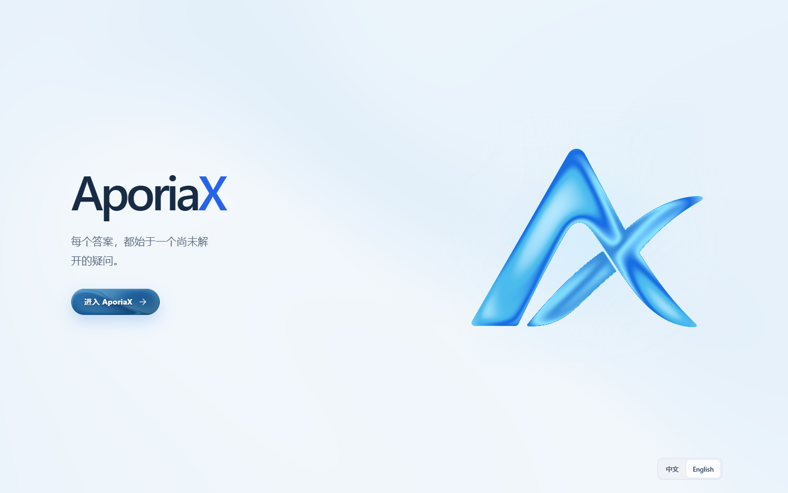
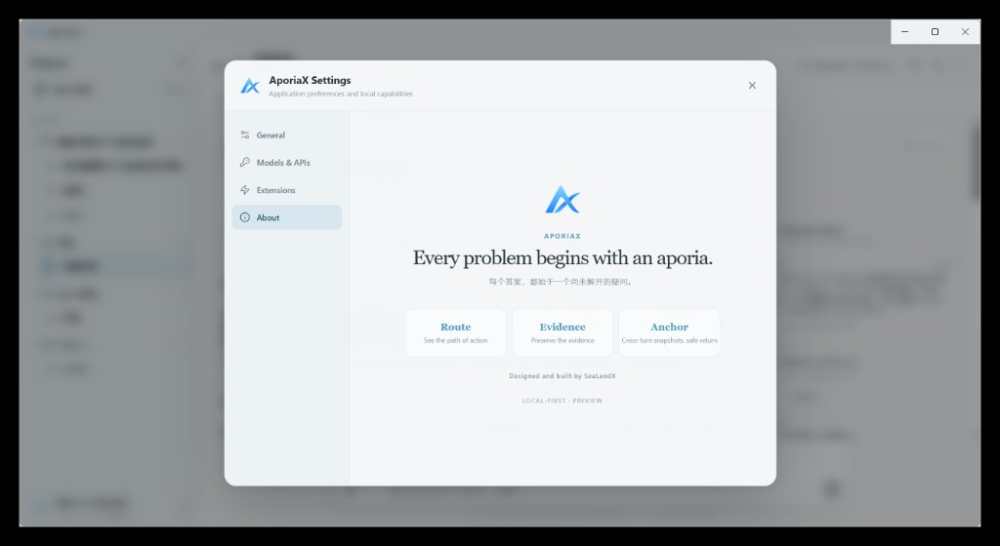
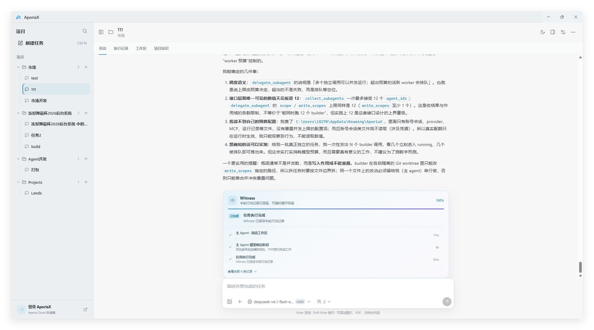
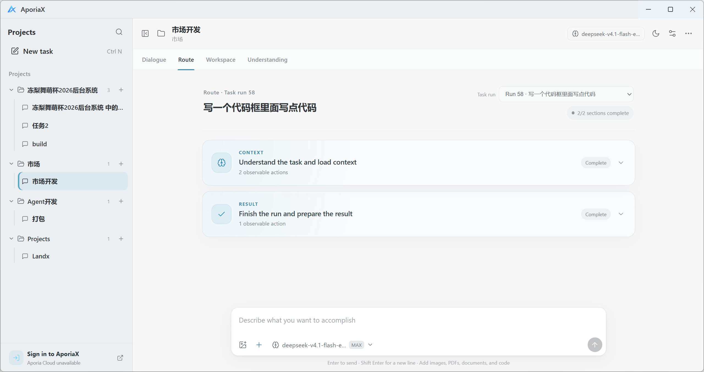
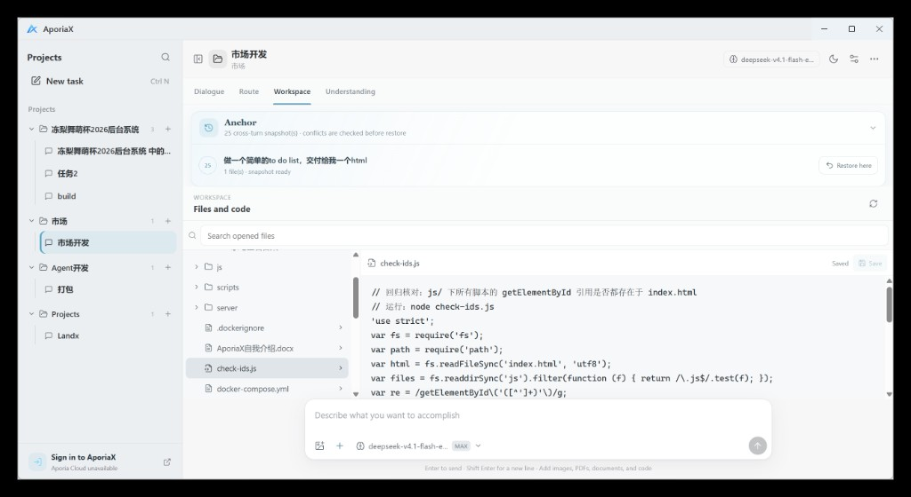
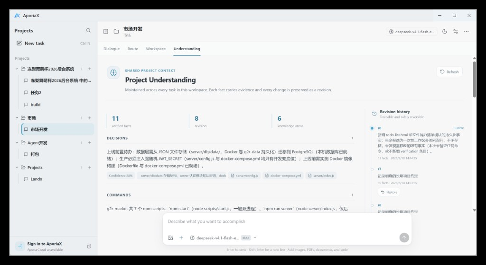
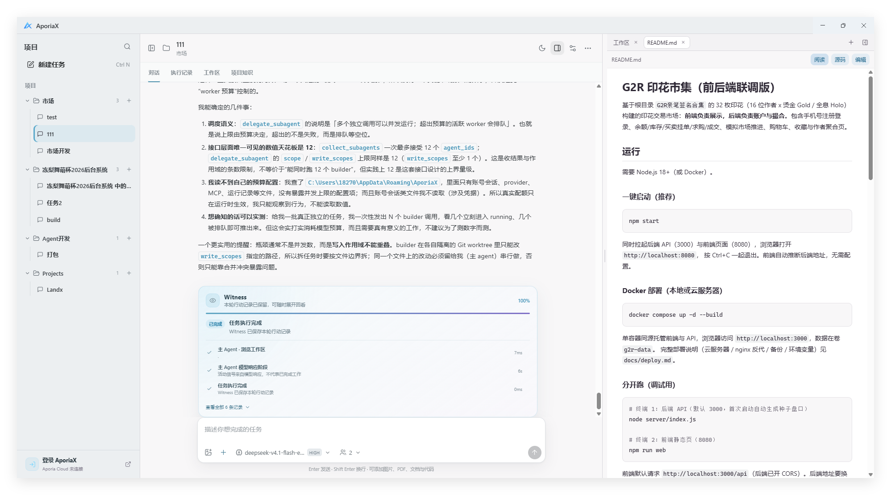
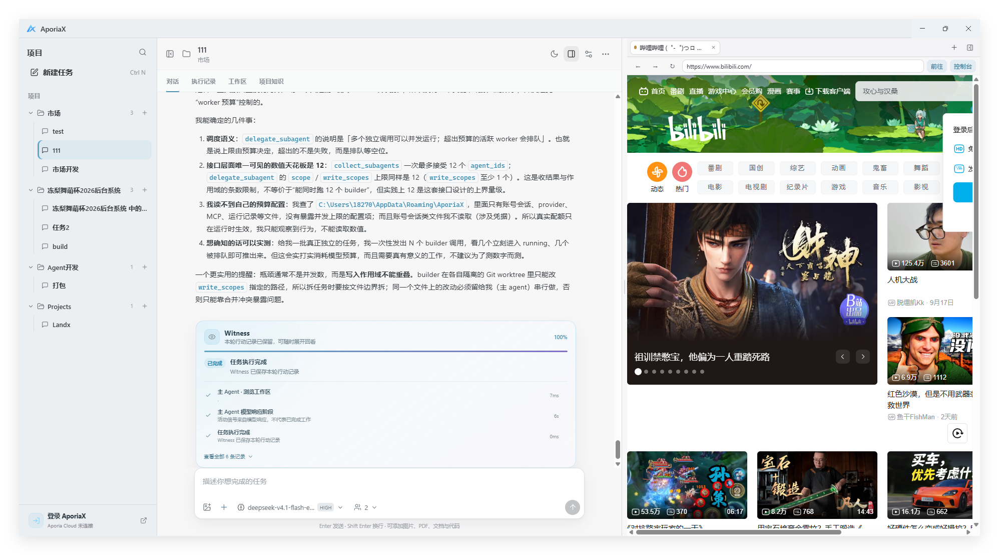
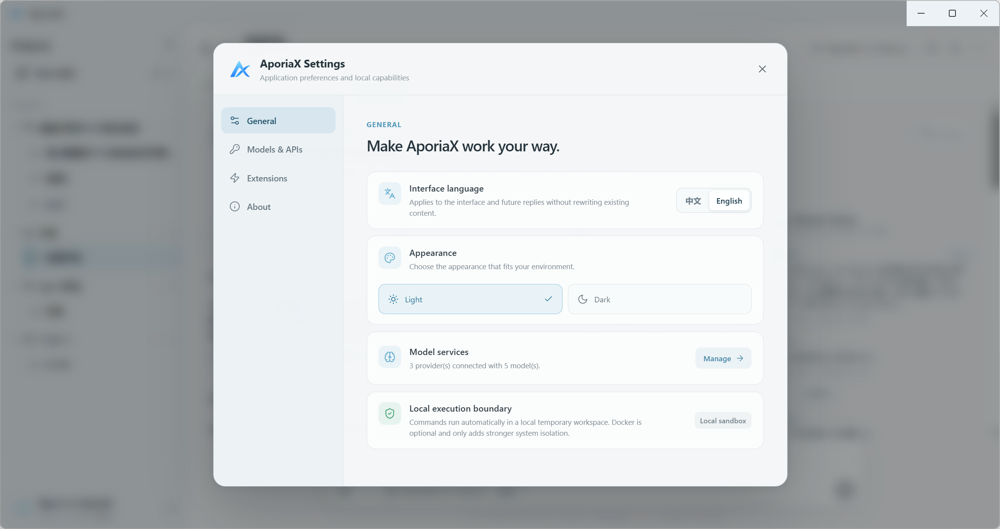
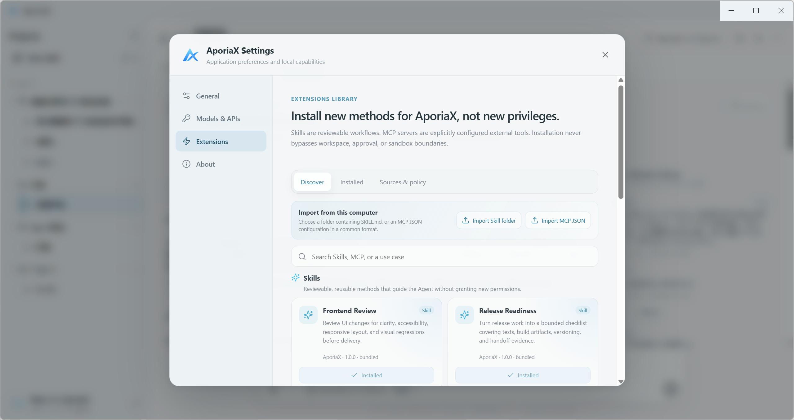

<p align="center"></p>
<h1 align="center">AporiaX</h1>
<p align="center"><em>Every problem begins with an aporia.</em></p>

<p align="center">
  <strong><a href="https://aporiax.cloud">Official website · aporiax.cloud</a></strong> · <a href="https://github.com/CaptainLand/AporiaX/releases/tag/v1.0.0-rc.5.1">Download RC5.1</a> · <a href="https://aporiax.cloud/guide/">User guide</a> · <a href="https://aporiax.cloud/account">Account center</a>
</p>
<p align="center"><a href="README.md">简体中文</a> · <a href="README_EN.md">English</a></p>
<p align="center">
  <a href="https://github.com/CaptainLand/AporiaX/releases/tag/v1.0.0-rc.5.1"></a>
  <a href="https://github.com/CaptainLand/AporiaX/tree/v1.0.0-rc.5.1"></a>
  <a href="LICENSE"></a>
</p>

AporiaX is a local-first Windows desktop agent for code, commands and Word / PowerPoint / Excel files. Conversation, files, browser, terminal and Git share one window, with execution records, evidence and rollback controls.

> [!IMPORTANT]
> Current version: **1.0.0-rc.5.1**, a release candidate—not final 1.0.0. [Release notes](https://github.com/CaptainLand/AporiaX/releases/tag/v1.0.0-rc.5.1) · [Matching source](https://github.com/CaptainLand/AporiaX/tree/v1.0.0-rc.5.1).
> Desktop authorization, account center, Cloud gateway and China downloads now use **[aporiax.cloud](https://aporiax.cloud)**. Old-endpoint credentials are not forwarded automatically; you may need to sign in again.
> RC5.1 is on the default update channel. Windows binaries remain unsigned and may trigger security warnings.

## RC5 highlights

- **Professional role settings:** configure Explore / Review / Verify / Curator / Builder or custom roles, models, reasoning and budgets. Builder concurrency moves to Settings.
- **Main-led delegation:** Main discovers and invokes configured roles; independent work can run in parallel, dependencies wait, and the runtime enforces concurrency and cumulative budgets.
- **Scoped capabilities:** select Skills, MCP, project knowledge and verification tools without exceeding parent permissions. The Agent panel shows status, results and usage, supports follow-ups and stop, and never invents unavailable cost data.
- **Official-domain integration:** desktop sign-in, account management, Cloud requests and China downloads use the website.
- **Opt-in project knowledge:** disabled tasks show an enable entry first; multiple knowledge projects per workspace are selected per task and read on demand.
- **RC4 foundations retained:** consistent light/dark layouts and main/side-chat model pickers, rolling context summaries, bounded recovery, Skills / MCP and local external connections.

Validation: **103/103** local core regression scripts, **30/30** desktop checks, and **6/6** [Windows / Linux CI jobs](https://github.com/CaptainLand/AporiaX/actions/runs/37784953275) passed. Mock-provider tests do not guarantee live-provider compatibility, speed or cost.

## Download

[Official website](https://aporiax.cloud) · [GitHub Latest](https://github.com/CaptainLand/AporiaX/releases/latest) · [Earlier releases](https://github.com/CaptainLand/AporiaX/releases)

| Windows x64 · RC5.1 | China mirror | GitHub |
| --- | --- | --- |
| Installer (recommended) | [Download](https://aporiax.cloud/downloads/AporiaX-Setup-1.0.0-rc.5.1-x64.exe) | [Download](https://github.com/CaptainLand/AporiaX/releases/download/v1.0.0-rc.5.1/AporiaX-Setup-1.0.0-rc.5.1-x64.exe) |
| Portable | [Download](https://aporiax.cloud/downloads/AporiaX-Portable-1.0.0-rc.5.1-x64.exe) | [Download](https://github.com/CaptainLand/AporiaX/releases/download/v1.0.0-rc.5.1/AporiaX-Portable-1.0.0-rc.5.1-x64.exe) |
| SHA-256 checksums | [Checksums](https://aporiax.cloud/downloads/SHA256SUMS-1.0.0-rc.5.1.txt) | [Checksums](https://github.com/CaptainLand/AporiaX/releases/download/v1.0.0-rc.5.1/SHA256SUMS-1.0.0-rc.5.1.txt) |

Older versions can use Settings → About → Check for updates. Installed builds download and restart to install; portable builds require replacing the executable. Latest enables update discovery; it does not mean final 1.0.0 acceptance is complete.

## Main capabilities

| Capability | Current implementation |
| --- | --- |
| Code and workspace | Paged reads, ripgrep search, file tree/editing, multi-file patches, Git status and diff |
| Workbench | Files, browser, terminal, Git and side chat; Agents can present artifacts beside the conversation |
| Git / GitHub | Init, staging/commits/branches, remotes, pull/push, repository creation, conflict editing and read-only PR / CI views |
| Professional roles | Default/custom responsibilities, model/reasoning/budget/capability settings, Main-led delegation |
| Builders | Concurrency 0–6 in Settings (default 2), task inheritance, isolated Git worktrees, scoped writes and conflict-safe integration |
| Long conversations | Same-model rolling summaries, local original-history readback and bounded recovery—not infinite context; summary calls consume normal usage |
| Project knowledge | Per-task opt-in, multiple knowledge projects per workspace, on-demand retrieval, sources and revisions |
| Extensions | Skills, MCP and native tools within parent permissions, file scopes and approvals |
| External connections | Authenticated local API / MCP using existing workspaces—not a publicly exposed remote service by default |
| Permissions | Direct / Safe / Isolated; outside-workspace access is off by default and explicit opt-in retains sensitive-directory protections |
| Documents and language tools | Word / PowerPoint / Excel generation and structural checks; LSP diagnostics, definitions and references |
| Aporia Cloud | Managed model, weekly quota, native images and server capability checks, separate from BYOK / local providers |
| Web account center | Quota, devices, security and per-request history; unresolved usage no longer pre-deducts shared daily capacity, while real settlement and reconciliation remain |
| Review and recovery | Execution records, diffs, snapshots and Anchors; uncertain side effects are not blindly replayed |
| Desktop background | System tray, completion notifications and elapsed time; recovery after exit is not an always-online service |

## First launch

1. Create a task and choose a local workspace.
2. Add your own API / local provider, or sign in to Aporia Account for Cloud.
3. Optionally enable project knowledge and configure collaborators in Settings → Professional roles.
4. Describe the outcome, then inspect execution records, file changes and deliverables.

[User guide](https://aporiax.cloud/guide/) · [Security boundaries](SECURITY.md)

## Interface preview

These are previously published screenshots, some from Preview builds—not all show RC5. The current package is authoritative.

<table>
  <tr>
    <td width="50%"></td>
    <td width="50%"></td>
  </tr>
  <tr>
    <td align="center"><strong>Begin with an aporia</strong><br><sub>Light welcome screen, bilingual entry</sub></td>
    <td align="center"><strong>See the route, roll back</strong><br><sub>Route · Evidence · Anchor</sub></td>
  </tr>
  <tr>
    <td width="50%"><a href="docs/assets/dialogue.png"></a></td>
    <td width="50%"><a href="docs/assets/route.png"></a></td>
  </tr>
  <tr>
    <td align="center"><strong>Dialogue</strong><br><sub>Task replies, Witness summaries and follow-ups</sub></td>
    <td align="center"><strong>Execution records</strong><br><sub>Newest first · Agent activations and Builder concurrency</sub></td>
  </tr>
  <tr>
    <td width="50%"><a href="docs/assets/workspace.png"></a></td>
    <td width="50%"><a href="docs/assets/understanding.png"></a></td>
  </tr>
  <tr>
    <td align="center"><strong>Workspace</strong><br><sub>File tree, syntax highlighting and sidebar previews</sub></td>
    <td align="center"><strong>Project knowledge</strong><br><sub>Organized by project, retrieved on demand</sub></td>
  </tr>
  <tr>
    <td width="50%"><a href="docs/assets/sidebar-documents.png"></a></td>
    <td width="50%"><a href="docs/assets/sidebar-browser.png"></a></td>
  </tr>
  <tr>
    <td align="center"><strong>Sidebar · Documents</strong><br><sub>Formatted Markdown with reading, source and editing modes</sub></td>
    <td align="center"><strong>Sidebar · Browser</strong><br><sub>Browse alongside your task without leaving the conversation</sub></td>
  </tr>
  <tr>
    <td width="50%"></td>
    <td width="50%"></td>
  </tr>
  <tr>
    <td align="center"><strong>General</strong><br><sub>Language, appearance, models, execution</sub></td>
    <td align="center"><strong>Extensions</strong><br><sub>Reviewable Skills and MCP</sub></td>
  </tr>
</table>

## Run from source

Requires **Node.js 22.12.0 or newer**. Check out the RC5.1 tag to match the published package rather than the development main branch.

```powershell
git clone --branch v1.0.0-rc.5.1 --single-branch https://github.com/CaptainLand/AporiaX.git
cd AporiaX
npm install
npm run dev
```

```powershell
npm run build
npm run dist:win
npm run test:audit-suite
```

Docker Desktop is needed only for Isolated mode; Direct and Safe work without it. API keys use Electron safeStorage encryption. Never put real credentials in source, issues or logs.

## Execution boundaries

Main delegates; the runtime enforces permissions, budgets, dependencies and concurrency. Builders use scoped file tools, not shell execution or publishing. Main / Verify chooses relevant checks, and a returned result is not automatically an accepted result.

Harness reads `AGENTS.md`, `APORIAX.md`, `DEEPAGENT.md` and `.aporiax/rules/*.md`. Workspace-root `.aporiax.json` can only tighten permissions, not elevate read-only tasks.

Automatic continuation requires a live app process. Exit/crashes, provider outages and real hardware sleep have limitations. Unreturned provider computation cannot be recovered, and rolling summaries are not unlimited memory. Cloud exhaustion never silently switches providers.

## Contributing and license

[Contribution guide](CONTRIBUTING.md) · [Security reports](SECURITY.md) · [Source Available License](LICENSE) © 2026 CaptainLand and the respective rights holders. The Chinese license text governs.

The current development source permits personal and internal business use, commercial use of independent outputs, modifications and free forks. Software resale, rebranded paid derivatives, paid unlocking and paid third-party access to the software's substantive functionality require separate written permission. Modified distributions must be identified as unofficial. Contact the maintainer through [GitHub Issues](https://github.com/CaptainLand/AporiaX/issues) for commercial permission.

This is source-available, not an OSI-approved open-source license. Independently granted historical MIT and third-party rights remain intact, including published RC5.2 copies. This source declaration change does not change app versions or reissue any release. See [licenses/NOTICE.txt](licenses/NOTICE.txt) and the preserved [MIT text](licenses/LEGACY-MIT.txt).
