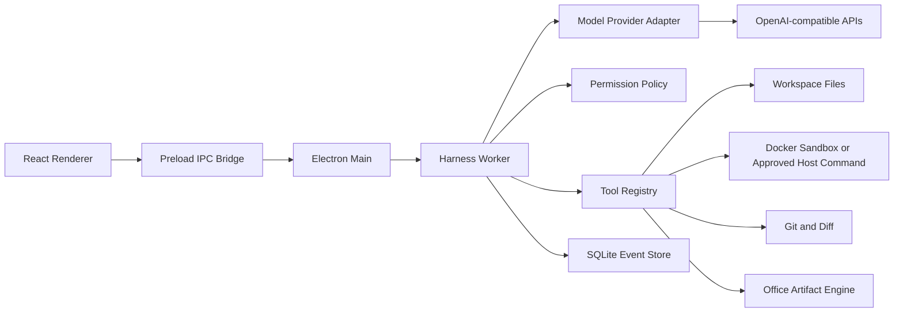

# AporiaX Agent Harness 路线图

## 当前实现状态

已完成：

- 多 OpenAI-compatible Provider、模型发现、SSE 流式回复、停止、空闲超时与自动重试
- 受限工作区路径校验与可手动停止的无限工具循环
- OpenCode 风格的工具注册表、工具风险元数据和细粒度权限策略
- `list_directory`、`read_file`、`search_text`、只读 `git_status` / `git_diff`、`write_file`、精确 `apply_patch`
- 内置 `.docx`、`.pptx`、`.xlsx` 生成工具与 Office 文件结构检查
- 默认本地临时工作区沙箱 `run_command`，自动执行并冲突检查同步；Docker 可选提供 OS 级强隔离
- 标准化 Turn / Tool / File 事件流与通用 Provider 边界
- 文件前后快照、逐行 Diff、冲突检测和安全撤销
- Office 二进制检查点、工件摘要审核、结构自检与安全撤销
- Harness 强制自检状态机、改动文件复读、项目验证命令与自检报告
- 长任务工具输出上下文压缩
- Electron 用户目录中的任务与检查点持久化
- `AGENTS.md` / `DEEPAGENT.md` 项目指令
- 图片附件 UI、文本模型能力拦截与历史消息净化
- 文件树、搜索和代码预览

仍需加强：

- Windows 原生 AppContainer 后端与 Linux `bubblewrap` 后端；当前本地模式是工作区级隔离，Docker 才提供 OS 级隔离
- SQLite append-only 事件存储；当前使用 Electron 用户目录 JSON
- Git 提交、分支/Worktree 管理和结构化补丁
- 视觉模型 Provider 与 OCR 降级链路
- Office 页面/幻灯片/工作表的无头渲染与像素级视觉 QA
- 真实任务 Eval、崩溃注入测试和打包签名

## 目标架构



渲染进程只消费事件和提交用户意图。API 密钥、模型请求、工具执行、路径校验和审批逻辑全部留在主进程后的独立 harness 层。

## Provider 抽象

不要让核心循环依赖 DeepSeek SDK 的具体返回结构。先定义统一接口：

```ts
interface ModelProvider {
  stream(request: ModelRequest, signal: AbortSignal): AsyncIterable<ModelEvent>;
}

type ModelEvent =
  | { type: "text.delta"; text: string }
  | { type: "reasoning.delta"; text: string }
  | { type: "tool.call"; call: ToolCall }
  | { type: "usage"; inputTokens: number; outputTokens: number }
  | { type: "response.completed"; stopReason: string };
```

当前实现通用 `OpenAICompatibleProvider`，Provider 注册表可以保存多个加密 API Key、
自动发现模型，并支持 OpenAI、DeepSeek、OpenRouter、本地 API 等兼容端点。

DeepSeek V4 推荐分工：

- `deepseek-v4-flash`：标题、摘要、简单问答、低成本预处理。
- `deepseek-v4-pro`：规划、代码修改、复杂诊断和长工具链。
- 普通交互关闭 thinking，复杂规划或工具任务启用 thinking。

thinking 模式发生工具调用时，provider 必须保留并在后续 API 请求中回传该轮 `reasoning_content`。核心 harness 不应假设它只是可丢弃的展示文本。

## Harness 状态机

一次 turn 使用显式状态机，避免无界递归：

```text
queued
  -> preparing_context
  -> requesting_model
  -> awaiting_tool
  -> awaiting_approval
  -> executing_tool
  -> requesting_model
  -> completed | cancelled | failed
```

每轮设置保护：

- 不限制模型往返次数，由最终回复、手动停止或真实错误结束
- 单工具超时
- 整轮超时
- 最大上下文和工具输出大小
- 可取消的 `AbortSignal`
- 网络错误指数退避与有限重试

## 第一批工具

只实现最小工具集合：

1. `list_files`
2. `read_file`
3. `search_text`
4. `git_status`
5. `git_diff`
6. `apply_patch`
7. `run_command`
8. `create_word_document`
9. `create_presentation`
10. `create_spreadsheet`
11. `inspect_office_file`

每个工具声明：

```ts
interface ToolDefinition {
  name: string;
  description: string;
  inputSchema: object;
  risk: "read" | "write" | "execute" | "network";
  timeoutMs: number;
  execute(input: unknown, context: ToolContext): Promise<ToolResult>;
}
```

模型输出不是可信输入。即使使用 strict tool calling，也必须在本地再次验证 JSON Schema、工具名、路径、参数和权限。

## 权限策略

默认模式：

- `read-only`：只允许读取工作区和无副作用检查。
- `workspace-write`：允许修改工作区，但写入前展示 Diff。
- `full-access`：暂不在 MVP 中提供。

关键约束：

- 所有路径先解析为真实绝对路径，再确认位于工作区根目录内。
- Shell 不接受任意拼接字符串，命令和参数分离传递。
- 删除、覆盖、Git push、安装软件、网络写入等操作必须单独审批。
- API Key 存入系统凭据库，不进入 React、localStorage、日志或项目文件。
- 工具返回值设定字节上限，并对长日志做截断和摘要。

## 事件与持久化

UI 只依赖统一事件：

```text
turn.started
message.delta
message.completed
tool.requested
approval.requested
tool.started
tool.output
tool.completed
file.changed
turn.completed
turn.failed
```

SQLite 建议表：

- `workspaces`
- `threads`
- `turns`
- `events`
- `approvals`
- `artifacts`

先采用 append-only 事件日志，再从事件投影 UI 状态。这样能支持任务恢复、审计、回放和故障诊断。

## 实施顺序

### Phase 1：Provider 单轮流式聊天

- Provider 适配器
- 密钥配置
- 文本流式输出
- 取消、超时、错误提示
- 暂不开放工具

### Phase 2：只读 Coding Agent

- 工作区上下文
- `list_files`、`read_file`、`search_text`
- 工具调用循环
- 工具输出截断
- 最大迭代次数

### Phase 3：修改与审批

- `apply_patch`
- `run_command`
- Git Diff
- 审批卡片
- Docker workspace-write 沙箱

### Phase 4：任务恢复

- SQLite 事件存储
- thread/turn 恢复
- 崩溃恢复
- 重试和回放

### Phase 5：质量与扩展

- 真实任务 Eval 集
- Provider/模型路由
- MCP
- Skills
- 多 Agent
- 打包、签名与自动更新

多 Agent、浏览器控制和插件系统应放在单 Agent 的工具循环、权限与恢复机制稳定之后。
