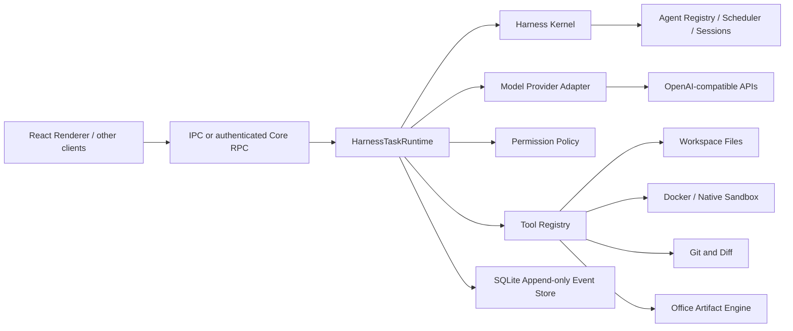

# AporiaX Agent Harness 路线图

## 当前实现状态

已完成：

- 多 OpenAI-compatible Provider、模型发现、SSE 流式回复、停止、空闲超时与自动重试
- 受限工作区路径校验与可手动停止的无限工具循环
- OpenCode 风格的工具注册表、工具风险元数据和细粒度权限策略
- `list_directory`、`read_file`、`search_text`、只读 `git_status` / `git_diff`、`write_file`、精确 `apply_patch`
- 内置 `.docx`、`.pptx`、`.xlsx` 生成工具与 Office 文件结构检查
- 默认本地临时工作区沙箱 `run_command`，自动执行并冲突检查同步；Docker 可选提供 OS 级强隔离
- 标准化 Turn / Tool / File 事件流与通用 Provider 边界
- 文件前后快照、逐行 Diff、冲突检测和安全撤销
- Office 二进制检查点、工件摘要审核、结构自检与安全撤销
- Harness 强制自检状态机、改动文件复读、项目验证命令与自检报告
- 独立 Explore / Review / Verify / Curator 子 Agent、后台执行、自动收集与安全并发
- Explore / Review / Verify / Curator 统一进入 AgentDefinition Registry、HarnessScheduler 与 HarnessSessionStore 后再执行
- Builder Task Graph、Scope Lease、隔离 Git worktree、冲突检查合并与 Main 集成
- Witness 事件监督层与 Dialogue 实时进度账本，记录主/子 Agent、耗时、停滞和重复失败
- Provider usage 校准的 token 估算、结构化 checkpoint、相关上下文检索与子 Agent 上下文隔离
- SQLite append-only Run Event Store，支持旧 JSON/JSONL 日志一次性自动迁移、事件回放与恢复查询
- `HarnessTaskRuntime` 统一管理 active run、pause/resume、steering、approval、interrupt 与 durable journal
- Renderer IPC 与 Core HTTP `taskRpc` 共用同一个 Task Runtime；关闭窗口不再主动终止正在运行的任务
- Electron 用户目录中的任务与检查点持久化
- 根目录及目录级 `AGENTS.md` / `APORIAX.md` / `DEEPAGENT.md`、`.aporiax/rules` 路径规则
- Electron 用户目录中的跨任务项目记忆，并拒绝保存疑似凭据
- 图片附件 UI、文本模型能力拦截与历史消息净化
- 文件树、搜索和代码预览

仍需加强：

- Windows 原生 AppContainer 后端与 Linux `bubblewrap` 后端；当前本地模式是工作区级隔离，Docker 才提供 OS 级隔离
- 将 Core 从 Electron main 进一步拆成可监督的独立 OS 进程；当前 Renderer 生命周期已解耦，但整个 Electron 主进程退出后仍需要从 Event Store 恢复任务
- 崩溃后从明确 checkpoint 自动续跑；当前 SQLite 已保留恢复所需事件，但任意 provider/tool 调用中点还不能无损热恢复
- 将凭据解析、审批服务和 Provider 构造进一步收敛到独立 Core 服务边界
- Git 提交、分支/Worktree 管理和结构化补丁
- OCR 降级链路与更强视觉 QA
- Office 页面/幻灯片/工作表的无头渲染与像素级视觉 QA
- 基于 embedding 的大规模历史语义索引；当前使用本地轻量相关度检索
- 真实任务 Eval、崩溃注入测试和打包签名

## 目标架构



渲染进程只消费事件和提交用户意图。当前 Task Runtime 已经不依赖窗口存活；下一阶段再把它从 Electron main 提升为可独立监督/重启的 Core 进程。

## Provider 抽象

不要让核心循环依赖 DeepSeek SDK 的具体返回结构。统一接口应保持类似：

```ts
interface ModelProvider {
  stream(request: ModelRequest, signal: AbortSignal): AsyncIterable<ModelEvent>;
}

type ModelEvent =
  | { type: "text.delta"; text: string }
  | { type: "reasoning.delta"; text: string }
  | { type: "tool.call"; call: ToolCall }
  | { type: "usage"; inputTokens: number; outputTokens: number }
  | { type: "response.completed"; stopReason: string };
```

当前实现通用 `OpenAICompatibleProvider`，Provider 注册表可以保存多个加密 API Key、自动发现模型，并支持 OpenAI、DeepSeek、OpenRouter、本地 API 等兼容端点。

DeepSeek V4 推荐分工：

- `deepseek-v4-flash`：标题、摘要、简单问答、低成本预处理。
- `deepseek-v4-pro`：规划、代码修改、复杂诊断和长工具链。
- 普通交互关闭 thinking，复杂规划或工具任务启用 thinking。

thinking 模式发生工具调用时，provider 必须保留并在后续 API 请求中回传该轮 `reasoning_content`。核心 harness 不应假设它只是可丢弃的展示文本。

## Harness 状态机

一次 turn 使用显式状态机，避免无界递归：

```text
queued
  -> preparing_context
  -> requesting_model
  -> awaiting_tool
  -> awaiting_approval
  -> executing_tool
  -> requesting_model
  -> completed | cancelled | failed
```

每轮设置保护：

- 不限制模型往返次数，由最终回复、手动停止或真实错误结束
- 单工具超时
- 整轮超时
- 最大上下文和工具输出大小
- 可取消的 `AbortSignal`
- 网络错误指数退避与有限重试

## 第一批工具

当前基础工具集合包括：

1. `list_directory`
2. `read_file`
3. `search_text`
4. `git_status`
5. `git_diff`
6. `write_file`
7. `apply_patch`
8. `run_command`
9. Office 创建/检查工具
10. Browser / MCP 等受 capability policy 约束的扩展工具

每个工具都需要风险元数据、输入验证、权限校验和有界输出。模型输出不是可信输入，即使使用 strict tool calling，也必须在本地再次验证工具名、路径、参数和权限。

## 权限策略

默认模式：

- `read-only`：只允许读取工作区和无副作用检查。
- `workspace-write`：允许修改工作区，并通过变更快照、Diff、自检和撤销保护写入。
- Builder 写入只发生在明确 Scope Lease 的隔离 worktree，合并前执行冲突检查。

关键约束：

- 所有路径先解析为真实绝对路径，再确认位于工作区根目录内。
- Shell 经过 sandbox/runtime policy，不把模型字符串直接当作可信宿主操作。
- 删除、覆盖、高风险网络/系统变更等操作进入审批策略。
- API Key 存入系统安全存储，不进入 React、localStorage、日志或项目文件。
- 工具返回值设定字节上限，并对长日志做截断和摘要。

## 事件与持久化

UI 只依赖统一事件，例如：

```text
turn.started
message.delta
message.completed
agent.runtime.queued
agent.runtime.started
subagent.started
tool.started
tool.completed
approval.required
control.paused
control.resumed
steering.queued
file.changed
turn.completed
turn.failed
run.finished
```

Run durable store 已切换到 SQLite：

- `runs` 保存当前 durable projection；
- `run_events` 保存按 sequence 追加的事件；
- `event_store_meta` 保存 schema / migration marker。

旧 `aporiax-runs/*.json` + `*.jsonl` 会在首次打开时导入 SQLite，并保留旧文件作为回滚证据。后续 thread/turn/artifact/approval 若需要更细粒度查询，可以继续在同一数据库上增加版本化 schema，而不再回到多份 JSON 真相源。

## Core / Client 边界

Renderer 已经不是 active task 生命周期的 owner。Desktop IPC 和 loopback Core HTTP 都操作同一个 `HarnessTaskRuntime`。

Core HTTP 已支持任务查询、创建、暂停、恢复、打断、steering、approval response 与 recovery acknowledge，并继续使用随机 bearer token 保护 loopback 接口。

关闭最后一个窗口时，如果仍有 active run，Electron main 保持存活，任务继续运行。再次启动 AporiaX 时，single-instance 机制可以重新创建窗口，客户端再查询 active/recoverable runs。

下一步目标是把这层进一步变为独立、可监督的 Core OS 进程，使 Electron main 自身也能崩溃/升级而不成为活任务的单点故障。

## 多 Agent 调度

当前 delegated Agent 的生命周期已经由 Kernel 统一接管：

```text
AgentDefinition Registry
        ↓
HarnessScheduler
        ↓
HarnessSessionStore
        ↓
Explore / Review / Verify / Curator execution loop
```

Builder 继续走写能力更严格的路径：

```text
Adaptive Budget
        ↓
Builder Preflight
        ↓
Task Graph
        ↓
Scheduler
        ↓
Scope Lease
        ↓
Isolated Git Worktree
        ↓
Conflict-Checked Merge
        ↓
Lead/Main Integration
```

底层成熟的 model/tool loop 暂时复用，不再让它拥有 Agent identity、session 或 scheduling。这样可以在不重写已验证执行行为的前提下逐步收口 runtime ownership。

## 实施顺序

### Phase 1：Provider 与单轮流式聊天

已完成基础 Provider 适配、密钥配置、文本流式输出、取消/超时/错误处理。

### Phase 2：Coding Agent 与工具循环

已完成工作区上下文、文件/搜索/Git 工具、工具调用循环、输出截断和 bounded runtime。

### Phase 3：修改、审批与沙箱

已完成 workspace write、自检、Diff/撤销、审批、Docker/本地工作区 sandbox 基线；原生 AppContainer/bubblewrap 仍需补齐。

### Phase 4：Runtime 与任务恢复

本阶段的第一部分已经完成：

- SQLite append-only Run Event Store
- 旧 JSON/JSONL 自动迁移
- `HarnessTaskRuntime`
- Desktop IPC / Core HTTP 统一控制面
- Renderer close 后 active task 继续运行
- delegated Agent Registry/Scheduler/Session 统一生命周期

剩余：

- 独立 Core OS 进程
- crash injection
- checkpoint-aware automatic resume
- Core 级 credentials / approval service

### Phase 5：质量与扩展

- 真实任务 Eval 集
- 更完整 Provider/模型路由
- Computer Use / Remote Relay
- 更成熟 Plugin/Skill 生态
- Office/视觉 QA
- 打包、签名与自动更新

浏览器控制、插件系统和跨机器调度应继续建立在权限、恢复、审计和 Eval 机制之上。
